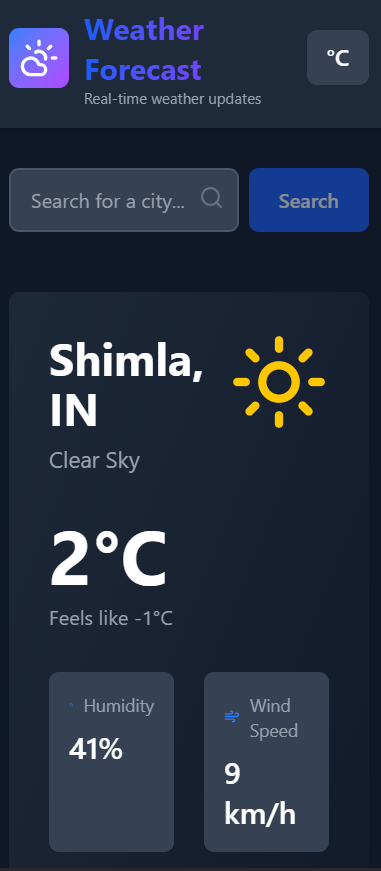
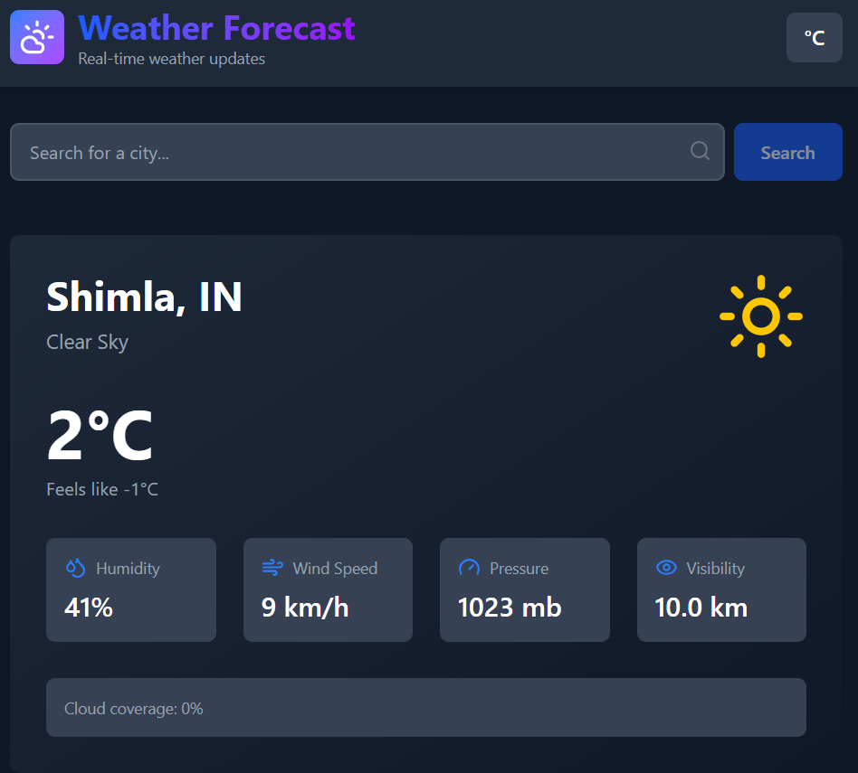

# Weather Forecasting Web Application

A modern, responsive weather forecasting application built with Next.js, React, TypeScript, and Tailwind CSS. Fetches real-time weather data from OpenWeatherMap API with features like dark mode, temperature unit toggle, geolocation support, and a 5-day forecast.

## 📸 UI Screenshots

| Feature | Screenshot |
|---------|-----------|
| **Home Page - Light** |  |
| **Weather Card - Light** |  |
| **Forecast - Light** |  |
| **Cities Table - Light** |  |

### Mobile Responsive
| Device | Screenshot |
|--------|-----------|
| **Mobile View** |  |
| **Tablet View** |  |

## 🌟 Features

### Core Functionality
- ✅ **Real-time Weather Data** - Fetch current weather information for any city
- ✅ **5-Day Weather Forecast** - View upcoming weather predictions
- ✅ **City Search** - Search for any city worldwide
- ✅ **Auto-Geolocation** - Automatically detects your location and shows weather
- ✅ **25-City Weather Table** - Display weather data for 25 major cities with pagination
- ✅ **Dark Mode Toggle** - Switch between light and dark themes with smooth transitions
- ✅ **Temperature Unit Toggle** - Switch between Celsius and Fahrenheit
- ✅ **Wind Speed Conversion** - Automatically converts between km/h and mph

### UI/UX Features
- ✅ **Responsive Design** - Works seamlessly on mobile, tablet, and desktop
- ✅ **Skeleton Loading** - Beautiful loading placeholders for better UX
- ✅ **Error Handling** - User-friendly error messages for invalid cities or network issues
- ✅ **Smooth Animations** - Transitions and hover effects throughout the app
- ✅ **Clean Modern UI** - Professional design with Tailwind CSS

### Technical Features
- ✅ **TypeScript** - Full type safety across the application
- ✅ **Next.js 16** - Latest version with App Router
- ✅ **React 19** - Modern React with hooks
- ✅ **Tailwind CSS v4** - Utility-first CSS with dark mode support
- ✅ **Custom Hooks** - Reusable logic (useGeolocation, useTemperatureConversion)
- ✅ **Axios** - HTTP client for API requests
- ✅ **Lucide React Icons** - Beautiful, customizable SVG icons

## 🛠 Tech Stack

- **Frontend Framework**: Next.js 16.1.1
- **UI Library**: React 19.2.3
- **Language**: TypeScript 5
- **Styling**: Tailwind CSS v4
- **HTTP Client**: Axios 1.13.2
- **Icons**: Lucide React 0.562.0
- **Weather API**: OpenWeatherMap
- **Node.js**: 18+ recommended

## 📋 Prerequisites

Before you begin, ensure you have the following installed:
- Node.js 18 or higher
- npm or yarn package manager
- Git (optional, for version control)

## 🚀 Installation & Setup

### Step 1: Clone the Repository
```bash
git clone https://github.com/tarunparmar752/weather-app.git
cd weather-app/weather-app
```

### Step 2: Install Dependencies
```bash
npm install
# or
yarn install
```

### Step 3: Get OpenWeatherMap API Key
1. Visit [OpenWeatherMap](https://openweathermap.org/api)
2. Sign up for a free account
3. Go to your API keys section
4. Copy your API key

### Step 4: Set Up Environment Variables
Create a `.env.local` file in the root directory and add your API key:

```env
NEXT_PUBLIC_WEATHER_API_KEY=your_api_key_here
```

**Note**: The `NEXT_PUBLIC_` prefix makes this variable accessible in the browser.

### Step 5: Run the Development Server
```bash
npm run dev
# or
yarn dev
```

The application will start at [http://localhost:3000](http://localhost:3000)

### Step 6: Build for Production
```bash
npm run build
npm run start
```

## 📁 Project Structure

```
weather-app/
├── src/
│   ├── app/
│   │   ├── layout.tsx           # Root layout with metadata
│   │   ├── page.tsx             # Main page with all features
│   │   └── globals.css          # Global styles with dark mode
│   ├── components/
│   │   ├── layout/
│   │   │   └── Header.tsx       # Header with theme and unit toggles
│   │   ├── weather/
│   │   │   ├── WeatherCard.tsx  # Current weather display
│   │   │   ├── Forecast.tsx     # 5-day forecast component
│   │   │   ├── Search.tsx       # City search input
│   │   │   └── CitiesTable.tsx  # 25-city weather table with pagination
│   │   └── SkeletonLoading.tsx  # Loading skeleton components
│   ├── hooks/
│   │   ├── useGeolocation.ts    # Geolocation hook
│   │   └── useTemperatureConversion.ts  # Temperature unit conversion
│   ├── types/
│   │   └── weather.ts           # TypeScript interfaces and types
│   └── utils/
│       └── weatherApi.ts        # OpenWeatherMap API functions
├── public/                      # Static assets
├── tailwind.config.ts           # Tailwind CSS configuration
├── tsconfig.json                # TypeScript configuration
├── next.config.ts               # Next.js configuration
├── package.json                 # Dependencies and scripts
└── README.md                    # This file
```

## 🎯 Usage Guide

### Searching for a City
1. Enter a city name in the search box
2. Click the "Search" button or press Enter
3. View the current weather and 5-day forecast

### Toggling Dark Mode
- Click the **Sun/Moon icon** in the header to toggle between light and dark themes
- The app will smoothly transition to the selected theme

### Toggling Temperature Units
- Click the **°C/°F button** in the header to switch temperature units
- All temperatures and wind speeds will update automatically

### Auto-Detecting Location
- Grant location permission when prompted by the browser
- The app will automatically fetch weather for your current location

### Viewing City Weather Table
- Scroll down to see the weather data for 25 major cities
- Use the pagination controls to navigate between pages
- Each page shows 10 cities

## 🌍 Weather Data

The application displays the following information:

### Current Weather
- City name and country
- Current temperature (in °C or °F)
- "Feels like" temperature
- Weather condition (Clear, Rainy, Cloudy, etc.)
- Humidity percentage
- Wind speed (in km/h or mph)
- Atmospheric pressure
- Visibility distance
- Cloud coverage

### 5-Day Forecast
- Date
- High/Low temperatures
- Weather condition
- Humidity
- Wind speed
- Weather icon

### City Table
- City name and country
- Temperature
- Weather condition
- Humidity
- Wind speed

## 🔧 Available Scripts

```bash
# Development server
npm run dev

# Build for production
npm run build

# Start production server
npm start

# Run linting
npm run lint
```

## 🐛 Troubleshooting

### API Errors
1. Verify your API key is correctly set in `.env.local`
2. Check that you have internet connectivity
3. Ensure the city name is spelled correctly
4. Check OpenWeatherMap API status

### Geolocation Not Working
1. Grant location permission when the browser prompts
2. Some browsers require HTTPS for geolocation
3. Check browser geolocation settings

## 🚀 Deployment

### Deploy to Vercel (Recommended)
```bash
npm install -g vercel
vercel
```

### Deploy to Other Platforms
1. Build the app: `npm run build`
2. Start the server: `npm start`
3. Set environment variable on your hosting platform

## 📝 Environment Variables

| Variable | Description | Required |
|----------|-------------|----------|
| `NEXT_PUBLIC_WEATHER_API_KEY` | OpenWeatherMap API Key | Yes |

### API Endpoints
Modify `src/utils/weatherApi.ts` to use a different weather API

### Cities in Table
Edit the `CITIES` array in `src/components/weather/CitiesTable.tsx`

## 📄 License

This project is open source and available under the MIT License.

## 👨‍💻 Author

Made by Tarun Parmar

## 🔗 Links

- [OpenWeatherMap API Documentation](https://openweathermap.org/api)
- [Next.js Documentation](https://nextjs.org/docs)
- [Tailwind CSS Documentation](https://tailwindcss.com)
- [React Documentation](https://react.dev)

## 🤝 Contributing

Contributions are welcome! Feel free to:
1. Fork the repository
2. Create a feature branch (`git checkout -b feature/amazing-feature`)
3. Commit your changes (`git commit -m 'Add amazing feature'`)
4. Push to the branch (`git push origin feature/amazing-feature`)
5. Open a Pull Request

## 🆘 Support

If you encounter any issues or have questions, please open an issue on GitHub.

---

**Enjoy exploring weather data with our beautiful Weather Forecasting Application!** 🌤️
